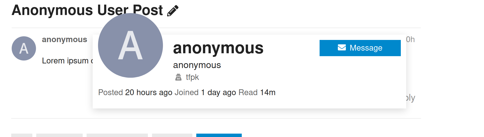
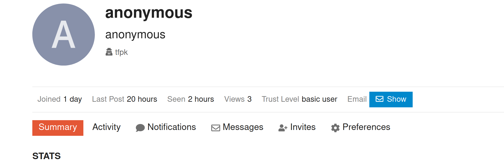

# discourse-reveal-anonymous

Allows anonymous users to have their true identity revealed by staff.

This plugin adds a small note to an anonymous user's profile, and to any cards that display their info.

## Examples

In each case, the user "anonymous" is actually "tfpk". You can see their real name next to an icon.

### Card Example

In this case, clicking "tfpk" will take you to his profile.

### Profile Example

In this case, clicking "tfpk" will show a card with a summary of the user.

## Credit

This plugin was based on the [Discourse Anonymous Moderators plugin](https://github.com/discourse/discourse-anonymous-moderators/).
