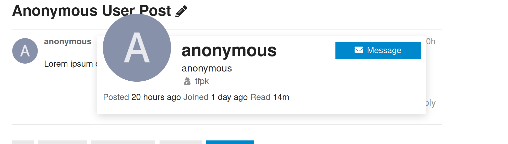
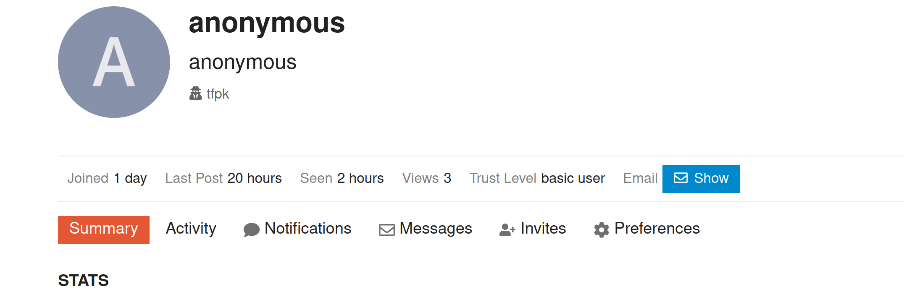

# discourse-reveal-anonymous

A [Discourse](https://www.discourse.org/) plugin that lets staff see who is behind an anonymous account.

Discourse's anonymous mode lets members post under a throwaway `anonymousN` account. This plugin adds a small link on that account's user card and profile, visible only to staff, that points at the member's real account.

## What it looks like

In both screenshots the user `anonymous` is really `tfpk`.

### User card



Clicking `tfpk` opens their profile.

### Profile



Clicking `tfpk` opens their user card.

## Who can see the real account

- **Staff only.** The real account is added to the user card and profile JSON only when the viewer is an admin or moderator. Regular members, logged-out visitors, and the anonymous account itself never receive it.
- **Not webhooks.** Webhook payloads are excluded, even though Discourse builds them with a system-user scope that would otherwise pass the staff check.
- **Basic fields only.** Only the real account's id, username, name, and avatar are included, and only for users that actually have a linked master account.

## Setting

| Setting                    | Default | Effect                                                    |
| -------------------------- | ------- | --------------------------------------------------------- |
| `reveal_anonymous_enabled` | off     | Turns the plugin on. Nothing is exposed while it is off. |

## Installation

Follow the standard [plugin installation guide](https://meta.discourse.org/t/install-plugins-in-discourse/19157) using this repository's URL:

```
https://github.com/Dylan-Brotherston/discourse-reveal-anonymous.git
```

Then enable `reveal_anonymous_enabled` in the admin site settings.

## Compatibility

Requires Discourse 2026.5.0 or newer. Sites running an older version are automatically pinned to the last release that used the legacy template format, via `.discourse-compatibility`.

## Development

```bash
pnpm install
pnpm lint
```

The request and system specs in `spec/` run in CI on every push and pull request through the shared Discourse plugin workflow. To run them locally, check the plugin out into the `plugins/` directory of a Discourse development install and run:

```bash
LOAD_PLUGINS=1 bin/rspec plugins/discourse-reveal-anonymous/spec
```

## Credit

Based on the [Discourse Anonymous Moderators plugin](https://github.com/discourse/discourse-anonymous-moderators/).

## License

Apache License 2.0. See [LICENSE](LICENSE).
